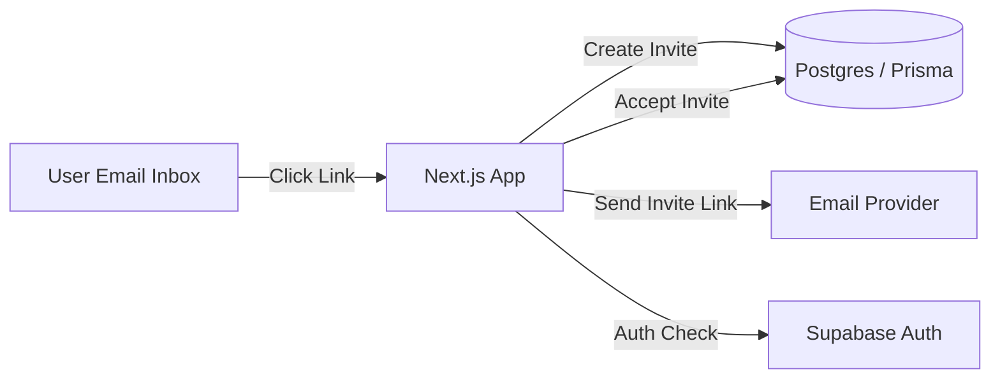
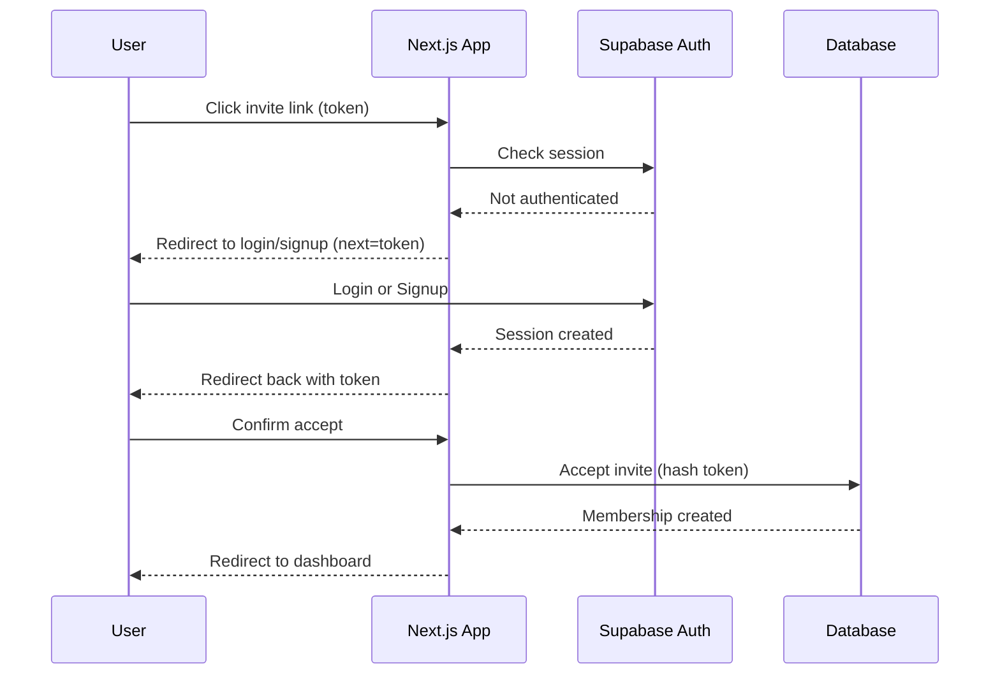
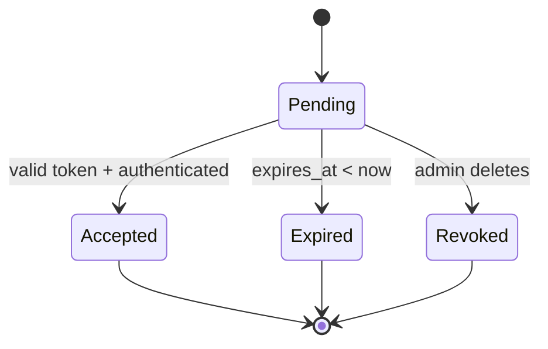
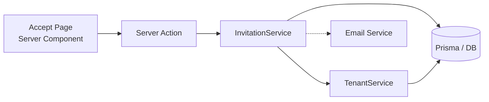

# Architecture – Invitation & Onboarding Flow

This document defines the **authoritative, production-grade architecture** for invitation acceptance, authentication gating, and tenant membership. It is intentionally **auth-provider agnostic** and designed to prevent user enumeration, token leakage, and replay attacks.

---

## Goals

* Secure invitation acceptance using **single-use, hashed tokens**
* Support **existing users**, **new users**, and **users in other tenants**
* Preserve invitation intent across **login / signup redirects**
* Keep **business logic** isolated from UI and infrastructure

---

## System Context



---

## End-to-End Invitation Acceptance Flow (Authoritative)

```mermaid
flowchart TD
    A[Invitation Email<br/>accept-invitation?token=XYZ]
    B[Accept Invitation Page<br/>(Server Component)]
    C{Authenticated?}
    D[Redirect to Login / Signup<br/>with next=accept-invitation?token=XYZ]
    E[Login or Signup]
    F[Redirect back to Accept Page]
    G[Accept Invitation UI]
    H[Submit Server Action]
    I[Validate Token<br/>Hash + Expiry + Single-use]
    J[Create Tenant Member]
    K[Mark Invitation Accepted]
    L[Redirect to Dashboard / Workspace]

    A --> B
    B --> C
    C -- No --> D
    D --> E
    E --> F
    F --> B
    C -- Yes --> G
    G --> H
    H --> I
    I --> J
    J --> K
    K --> L
```

**Guarantees**

* No email-based branching or user enumeration
* Token survives authentication redirects
* Acceptance is server-only
* Token is single-use and hashed in storage

---

## Runtime Sequence



---

## Invitation State Machine



---

## Component & Service Responsibilities




---

## Invitation Metadata & Granular Permissions

Invitations now support a `metadata` field (JSON) which is used to store granular permissions and other module-specific data.

* **Persistence**: When an invitation is created, module-specific permissions are stored in the `metadata` column of the `TenantInvitation` table.
* **Transfer**: Upon acceptance (via `acceptInvite` or `acceptInviteById`), this metadata is automatically mapped to the `metadata` field of the new `TenantMember` record.
* **DTO Standard**: The `InvitationService.createInvite` method now accepts an `InviteMemberDTO`, ensuring type safety for email, role, and permissions.

---

---

## Security Rules (Non-Negotiable)

* Tokens are **cryptographically random**, **hashed at rest**, and **single-use**
* Tokens are never stored in cookies, localStorage, or logs
* Token validation happens **only on the server**
* No pre-auth checks against `users` table

---

## Folder Structure (Reference)

```
src/
 ├─ domain/
 │   ├─ invitations/
 │   │   └─ invitation.service.ts
 │   ├─ tenants/
 │   │   └─ tenant.service.ts
 │
 ├─ infra/
 │   ├─ email/
 │   │   └─ resend.service.ts
 │   └─ db/
 │       └─ prisma.ts
 │
 ├─ app/
 │   └─ accept-invitation/
 │       ├─ page.tsx
 │       ├─ actions.ts
 │       └─ AcceptInvitationForm.tsx
```

---

## Summary

This architecture ensures:

* Strong security guarantees
* Clear separation of concerns
* Compatibility with multiple auth methods
* Maintainability at scale

This document is the **source of truth** for invitation and onboarding behavior.
